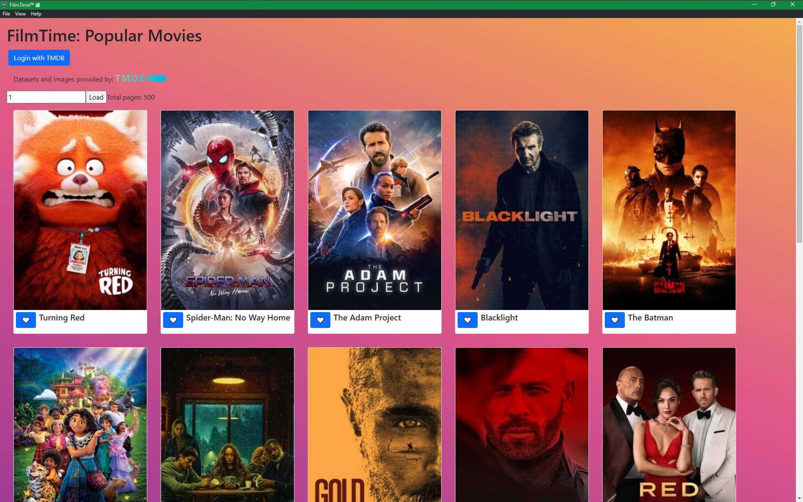

## Starting Development

Start the app in the `dev` environment:

```bash
yarn start
```

## Boilerplate Docs

See `electron-react-boilerplate` [docs and guides here](https://electron-react-boilerplate.js.org/docs/installation)

## Packaging for Production

To package apps for the local platform:

```bash
yarn run package
```

If you "package" the application and install it on your computer, then you can operate the application
in full production mode. You'll need to fulfill all the system requirements of being able to develop/build on your host
system, too -- often extra burdensome on MacOS, for instance (e.g. XCode et al); see the boilerplate docs and guides
for more details (see section above).

The installer file(s) are created under the directory `release/build`.

## Screenshots

FilmTime '/' Route - Popular Movies, not logged-in to TMDB account

- Pagination is possible (up to 500 pages)



---

FilmTime '/' Route - Login Prompt


---

TMDB, in main browser - Auth Select Screen


---

TMDB, in main browser - Login Screen


---

TMDB, in main browser - Auth Request Screen


---

TMDB, in main browser - Access Granted Screen


---

FilmTime '/' Route - Login Prompt - Press Continue


---

FilmTime '/' Route - Logged In

- "Liked/Favorited" movies are marked with a red heart
- Unmarked movies have a simple, empty, white heart
- Clicking the heart button toggles the state


---

FilmTime '/liked' Route - Favourite Movies - Log-in Requred

- Pagination is possible (up to 500 pages)


---

## System Requirements for End-Users

- Modern Computer, something produced 2012 or later would be ideal.
- Internet connectivity; 50 Mbps or faster would be desireable.
- An account with TMDB; used for tracking "likes/favorites"; pre-existing
  "likes/favorites" are entirely acceptable.

## Explanations -- Key Architectural Choices

👉 **key components of proposed solution**

Components Collection - A mishmash of relevant components were produced, by hand,
at the root of `src/renderer` folder. `Home` and `Liked` are the top-level sections.
`PopularMovies` and `FavoriteMovies` render lists of `Movie` items. `AccountPane`
handles most of the account-related business logic. `interfaces/AccountManager` is
constructed at the top-most level, `App` and then pushed-down to all the child
components. `TmdbCredits` is required per TMDB's terms for using its datasets
and services.

`localStorage` is used for persistent, long-term storage of a user's session.

[Bootstrap](https://getbootstrap.com)
via [react-bootstrap](https://react-bootstrap.github.io/)
is used to obtain a baseline set of helpful scaffolding units.

[moviedb-promise](https://www.npmjs.com/package/moviedb-promise)
is used to handle most requests against TMDB API endpoints.
There was one oddity related to updating an account's set of favourite movies,
so those API calls were actually implemented with vanilla JavaScript: `fetch`.

TMDB's own account system was used for managing "likes/favorites" in a persistent
fashion.
